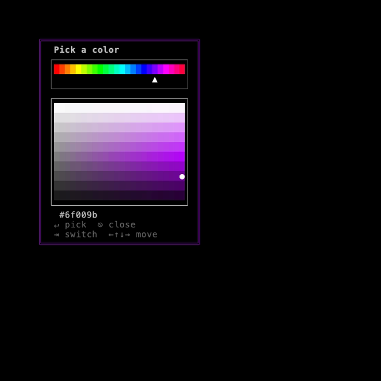
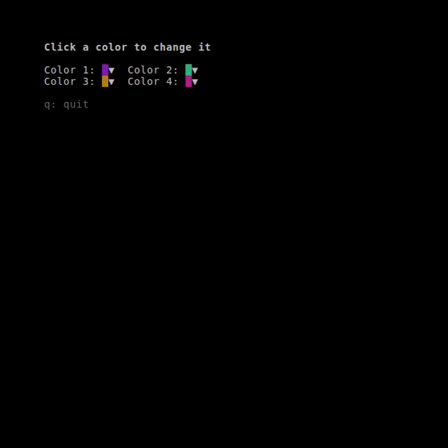
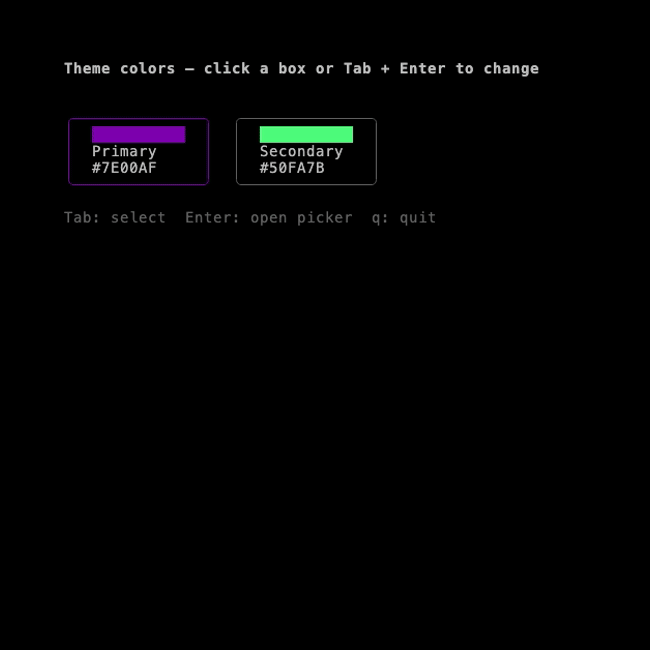

# bubble-color-picker

A [Bubble Tea](https://github.com/charmbracelet/bubbletea) color picker component for terminal UIs. Pick colors with keyboard and mouse; get a hex value back for use with [lipgloss](https://github.com/charmbracelet/lipgloss) or your theme config.

## Features

- **HSL picker**: Hue bar + saturation/lightness grid
- **Keyboard-first**: Tab / Shift+Tab cycle focus (presets row if configured, then hue bar, then S/L grid). Arrows (or hjkl) adjust values; Enter confirms; Esc cancels.
- **Mouse (zone-based)**: Move the mouse over the hue bar or grid to set H or S/L; **release the left button on the grid** to accept. Uses [bubblezone](https://github.com/lrstanley/bubblezone) for reliable hit-testing—no coordinate math.
- **Controlled component API**: `New(...Option)` with `WithInitialColor`, `WithPresets`, `WithStyle`, `WithAutoDismiss`. Selection is delivered as **`ColorChangedMsg`** (a `tea.Cmd`); `ColorChosenMsg` remains a type alias for compatibility.

## Installation

```bash
go get github.com/madicen/bubble-color-picker
```

The Go import path is `github.com/madicen/bubble-color-picker` (package name `bubblepicker`).

## Examples

| Example | Description |
|--------|-------------|
| [**simple**](./examples/simple) | Picker is the entire app. |
| [**swatch**](./examples/swatch) | 2×2 grid of color swatches; click any to open the modal picker. |
| [**modal**](./examples/modal) | Two color boxes; Tab + Enter or click to open the picker over the main view. |

### Screenshots

*(Generated by the VHS tapes in `vhs/`. Run them locally or use the **Generate Screenshots** workflow.)*

#### Simple — picker as the whole app



#### Swatch — click to open modal picker



#### Modal — picker over the main view



### Generating screenshots

Screenshots are generated with [VHS](https://github.com/charmbracelet/vhs). From the `bubblepicker` directory:

```bash
# Install VHS (see https://github.com/charmbracelet/vhs#installation)
make screenshots
```

The **Generate Screenshots** workflow (manual or after release) runs these tapes in CI and uploads the images as artifacts. If bubblepicker is used inside another repo (e.g. as a subdirectory), run the same commands with that repo’s working directory set to `bubblepicker`, or add a job that uses `working-directory: bubblepicker`.

### Running the examples

From the `bubblepicker` directory:

```bash
go run ./examples/simple   # Picker is the whole app
go run ./examples/swatch   # 2×2 swatches; click to open modal
go run ./examples/modal    # Two boxes; Tab+Enter or click to open
```

Enable **mouse** with `tea.WithMouseAllMotion()` so the picker receives motion and click events.

---

## Quick start (picker only)

For a minimal app that is just the picker:

```go
package main

import (
	tea "github.com/charmbracelet/bubbletea"
	zone "github.com/lrstanley/bubblezone"
	bubblepicker "github.com/madicen/bubble-color-picker"
)

func main() {
	zm := zone.New()
	picker := bubblepicker.New(bubblepicker.WithInitialColor("#7E00AF"))
	picker.SetZoneManager(zm)
	app := &model{picker: picker, zm: zm}
	p := tea.NewProgram(app, tea.WithAltScreen(), tea.WithMouseAllMotion())
	model, _ := p.Run()
	_ = model
}

type model struct {
	picker bubblepicker.Model
	zm     *zone.Manager
}

func (m *model) Init() tea.Cmd { return nil }

func (m *model) Update(msg tea.Msg) (tea.Model, tea.Cmd) {
	switch msg.(type) {
	case bubblepicker.ColorChangedMsg:
		return m, tea.Quit
	case bubblepicker.ColorCanceledMsg:
		return m, tea.Quit
	}
	updated, cmd := m.picker.Update(msg)
	m.picker = updated.(bubblepicker.Model)
	return m, cmd
}

func (m *model) View() string {
	return m.zm.Scan(m.picker.View())
}
```

Mouse interaction (hover to change, release on grid to accept) only works when:

1. You set a zone manager on the picker with `picker.SetZoneManager(zm)`.
2. You wrap the picker’s view with `zm.Scan(...)` so zones are registered.

---

## SwatchPicker (modal from a color square)

**SwatchPicker** is a small color square that opens the full modal picker when clicked. Overlay positioning and mouse handling are done for you.

1. Create a swatch: `swatch := bubblepicker.NewSwatchPicker("#7E00AF", "Primary")`
2. Give the app a zone manager and set it on each swatch: `swatch.SetZoneManager(zm)` (so the picker uses zones when open).
3. In **View**: build your main view with each swatch wrapped in `zm.Mark("swatch-0", "Color 1: "+swatch.SwatchView())` (or similar), call `swatch.SetBounds(row, col, w, h)` before overlays, then overlay and scan: `return zm.Scan(swatch.ViewWithOverlay(mainView, width, height))`.
4. In **Update**: when no modal is open and you get a left press, use `zm.Get("swatch-i").InBounds(msg)` to find which swatch was clicked and forward the message only to that swatch; when a modal is open, forward all non–WindowSize messages to the open swatch. On `ColorChangedMsg` / `ColorChosenMsg`, the swatch already has the new color.

See [examples/swatch](./examples/swatch) for a full 2×2 grid.

### Embedding SwatchPicker in an app that uses bubblezone

When the SwatchPicker lives inside a **tab** or **submodel** of a larger app (e.g. a settings tab with multiple sub-tabs and zone-based mouse), follow these steps so the picker opens, receives input, and closes correctly.

1. **Opening the swatch**  
   Bubblezone delivers zone messages on **release**, but the swatch opens on **press**. So when your tab (or root) receives a **mouse press** (`tea.MouseActionPress`), check whether the press is inside the swatch zone—e.g. `zm.Get(zoneID).InBounds(msg)`—and, if so, forward that **press** to the swatch. If you only forward zone/click messages (which carry the release), the swatch will not open on that click.

2. **When the picker is open**  
   Forward **all** non–`WindowSizeMsg` messages (keys, mouse, etc.) to the open swatch so the picker receives input. Use `swatch.Open()` to know when the modal is active and route messages only to that swatch.

3. **Closing the picker**  
   `ColorChangedMsg` (same shape as legacy `ColorChosenMsg`) and `ColorCanceledMsg` are returned as `tea.Cmd` and are delivered to your **root** (or top-level) model in a later `Update` cycle. The root must handle them and forward to the submodel that owns the swatch (e.g. the settings tab), which then calls `themeModel.Update(msg)` so the swatch can close and update. If the root does not handle these message types, they are dropped and the picker never closes.

4. **Same-click release**  
   The library ignores the first left-button **release** after the swatch opens (the release of the same click that opened the modal), so that release does not confirm the color. You do not need to track or drop that release in the host.

---

## Modal use (picker on top of another view)

For full control (e.g. multiple color boxes, Tab+Enter), use [bubble-overlay](https://github.com/madicen/bubble-overlay) and a zone manager for the main view and the picker. When the modal is open:

- Set the zone manager on the picker: `picker.SetZoneManager(zm)`.
- Render with `zm.Scan(viewWithModal())` so picker zones (hue bar, grid) are registered.
- Forward **raw** mouse events to the picker (no coordinate conversion); bubblezone uses screen positions.

**Sizing:** use `lipgloss.Size(modalView)` for modal width/height (same as bubble-overlay’s helpers and `OverlayStack`), then pass your clamped `top`/`left` into `overlay.OverlayView`. On recent bubble-overlay, you can alternatively use `overlay.Fixed(top, left).Origin(...)` from the same `Placement` API as `OverlayStack`. Recent releases improve ANSI compositing (grapheme-aware width, pen reset before the modal) for correct lipgloss alignment.

For **dimming** the main view or **stacked** modals, see bubble-overlay’s `DimSurface`, `OverlayConfig`, and `OverlayStack`.

See [examples/modal](./examples/modal) for two color boxes and overlay logic.

---

## Configuration (controlled component)

Build the picker with **`New(...Option)`**:

| Option | Purpose |
|--------|---------|
| **`WithInitialColor(hex string)`** | Starting HSL from hex (`"#ff0000"` or empty → default red). |
| **`WithPresets([]string)`** | Brand swatches shown above the hue bar. Tab to the preset row, ←/→ to move, Enter to confirm that hex (or click with zones). Invalid hex entries are skipped. |
| **`WithStyle(s lipgloss.Style)`** | Outer frame (border, padding). Without this, the picker uses its default double border tinted by the current color. |
| **`WithAutoDismiss(bool)`** | When `true`, `ColorChangedMsg` includes **`Dismiss: true`** so the host can remove the picker from the layout immediately after a selection. |

Example:

```go
picker := bubblepicker.New(
	bubblepicker.WithInitialColor(cfg.Primary),
	bubblepicker.WithPresets([]string{"#7E00AF", "#00AF7E", "#241", "#fff"}),
	bubblepicker.WithAutoDismiss(true),
)
```

---

## API

### Picker

- **`New(opts ...Option) Model`** — Construct with zero or more options; defaults match the original single-purpose picker.
- **`Value() string`** — Current color as hex (e.g. `"#7E00AF"`).
- **`View() string`** — Renders the picker (default frame: double border tinted by current value unless `WithStyle` is used).
- **`ViewSize() (width, height int)`** — Rendered size in cells (including border). Use for overlay positioning.
- **`SetZoneManager(zm *zone.Manager)`** — Enable zone-based mouse (hue bar, grid, and preset strip when present). Call from the same app that runs `zone.Scan()` on the view.
- **`ColorChangedMsg`** — `struct { Color string; Dismiss bool }`. Emitted when the user confirms (Enter, preset Enter, or mouse release on grid). Handle in `Update`; check **`Dismiss`** when using `WithAutoDismiss(true)`.
- **`ColorChosenMsg`** — Type alias of `ColorChangedMsg` for existing code.
- **`ColorCanceledMsg`** — Sent when the user presses Esc.

### SwatchPicker

- **`NewSwatchPicker(initialColor, label string) *SwatchPicker`** — Create a swatch; click opens the modal picker.
- **`SwatchView() string`** — The swatch UI (color cell + ▼) to embed in your main view.
- **`Size() (width, height int)`** — Swatch size in cells; use for layout and SetBounds.
- **`SetBounds(row, col, w, h int)`** — Where the swatch is drawn (0-based). Call before ViewWithOverlay. `row` and `col` are in **full-view** coordinates (the complete string you pass to `Scan()`); if the swatch is inside a sub-view (e.g. a panel), add the sub-view’s starting line index to the local row.
- **`ViewWithOverlay(mainView, viewWidth, viewHeight int) string`** — Returns the view (overlays the modal when open).
- **`SetZoneManager(zm *zone.Manager)`** — Use zone-based mouse when the picker is open; host must run `zone.Scan()` on the view.
- **`Update(tea.Msg) (*SwatchPicker, tea.Cmd)`** — Forward all messages; assign the returned pointer back.
- **`SetColor(string)`** / **`Color() string`** — Set or read the current color.
- **`Open() bool`** — True when the picker modal is open. When true, route input only to that swatch.
- **`SetFocused(bool)`** / **`Focused() bool`** — For keyboard-only UIs: highlight the arrow (▼).

---

## Use in jj-tui (or any TUI)

Embed `bubblepicker.Model` or `SwatchPicker` in your settings screen. On `ColorChangedMsg`, write `msg.Color` to your config (e.g. primary, background) and re-render your lipgloss styles.

---

## License

MIT
